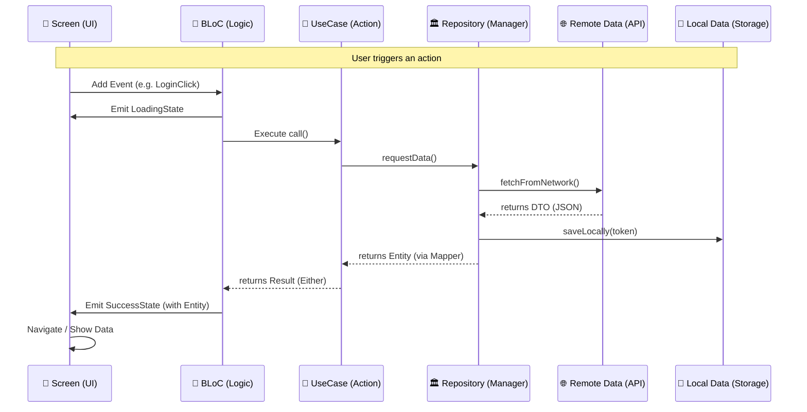

# 🌊 Bloc Clean Architecture (BCA) - Deep Documentation

> **A high-performance, modular Flutter boilerplate built for production-grade applications.**
> This architecture focuses on **Scalability**, **Testability**, and **Developer Productivity**.

---

## 🚀 Quick Start (Get Running in 2 Mins)

If you are new to the project, run these commands in order:

```bash
# 1. Install dependencies
make setup

# 2. Generate all boilerplate code (DI, JSON, Freezed)
make build

# 3. Start the app
flutter run
```

---

## 🏗 Architecture Philosophy (The "Big Picture")

We follow **Clean Architecture** to ensure that business logic is independent of the UI and external tools. The dependency flow is strictly **Unidirectional**: `Presentation → Domain ← Data`.

### 🧩 1. The Domain Layer (The "Brain")
*Pure Dart logic. No Flutter, No API knowledge.*
- **Entities**: Simple classes representing your data (e.g., `User`).
- **Use Cases**: One class = One action (e.g., `LoginUseCase`).
- **Repositories (Interfaces)**: Contracts that define what the app can do.
- **Error Handling**: Uses `dartz` `Either<AppException, T>`. No `try-catch` in the UI!

### 📦 2. The Data Layer (The "Workforce")
*How data is actually fetched and stored.*
- **Data Sources**: The raw workers (Remote for APIs, Local for Cache).
- **Models/DTOs**: JSON-specific classes (using `freezed`).
- **Mappers**: Bridges that convert raw `Models` into clean `Entities`.
- **Repository Impl**: The glue that decides whether to fetch from the web or the local cache.

### 📱 3. The Presentation Layer (The "Face")
*Everything the user sees.*
- **State Management**: `flutter_bloc` (Events in, States out).
- **Atomic Widgets**: Small, reusable UI pieces.
- **Routing**: `go_router` for type-safe navigation.

---

# 🗺 The 5-Step Journey (Feature Development Guide)

**Freshers start here!** To build any new feature (e.g., `Profile`), follow this exact sequence:

### 1️⃣ Step 1: 🧩 Domain (Define the "What")
- Create **Entity** in `domain/entities/`.
- Create **Repository Interface** in `domain/repositories/`.
- Create **Use Case** in `domain/usecases/`.

### 2️⃣ Step 2: 📦 Data (Define the "How")
- Create **Model/DTO** in `data/models/`.
- Create **Data Source** (Remote/Local) in `data/datasources/`.
- Create **Repository Implementation** in `data/repositories/`.
- Create **Mapper** in `data/mappers/` (Model ➡️ Entity).

### 3️⃣ Step 3: 🧠 Presentation (The Logic & UI)
- Create **BLoC** (Event, State, Bloc) in `presentation/bloc/`.
- Create **Screen** in `presentation/screens/`.
- Create **Widgets** in `presentation/widgets/`.

### 4️⃣ Step 4: 💉 Wiring (Dependency Injection)
- Add `@injectable` to your DataSources, Repositories, and BLoCs.
- Run `make build` to link everything together.

### 5️⃣ Step 5: 🚦 Routing (Navigation)
- Register your screen in `lib/app/router/app_router.dart`.

---

## 🔄 The Visual Flow (How Data Travels)



---

## ⚙️ Core Infrastructure (For Experienced Devs)

### 🔌 Dependency Injection (DI)
We use `get_it` + `injectable`.
- **Annotation-based**: Just add `@injectable` or `@lazySingleton`.
- **Pre-resolve**: Used for async setups like `SharedPreferences`.

### 🌐 Networking & Interceptors
A robust `Dio` implementation with:
- **Connectivity**: Auto-check for internet.
- **Auth**: Auto-injects Bearer tokens and handles `401 Unauthorized`.
- **Encryption**: Transparent `AES` encryption for all payloads.
- **Logging**: Clean console logs using `talker_dio_logger`.

### 💾 Strategy-Based Storage
We use the **Strategy Pattern** for local storage:
- `SharedPrefsStrategy`: Fast, key-value storage.
- `SecureStorageStrategy`: Encrypted storage for sensitive data (Tokens).
- `StorageFacade`: Swappable at runtime.

### 🔒 Enterprise Security
- **SSL Pinning**: MitM protection.
- **Jailbreak Detection**: Blocks rooted devices.
- **Privacy Mode**: Disables screenshots on sensitive pages.

---

## ⚠️ The Golden Rules
> [!IMPORTANT]
> 1. **Unidirectional Flow**: UI ➡️ BLoC ➡️ UseCase ➡️ Repository. **Never skip a step.**
> 2. **Entities Only**: BLoC and UI should only ever see **Entities**. Never pass a **Model/DTO** to the UI.
> 3. **No try-catch in BLoC**: Handle all errors in the Repository and map them to `AppException`.
> 4. **Immutability**: All States and Events must extend `Equatable`.

---

## 📂 Project Directory Structure

```text
lib/
├── app/                # Global config, Router, Root View
├── core/               # The "Engine": DI, Network, Services, Failure
├── features/           # Self-contained business modules (Auth, Splash, etc.)
│   └── <feature>/
│       ├── data/       # Implementation details (DTOs, Repos, Sources)
│       ├── domain/     # Business logic (Entities, UseCases)
│       └── presentation/# UI components (Bloc, Screens, Widgets)
├── resources/          # Design System: Themes, Colors, Icons
└── utilities/          # Global helpers & extensions
```

---

## 📝 Developer Toolbox (Makefile)

| Command | Action |
|---------|--------|
| `make setup` | Fresh install of all dependencies |
| `make build` | Generate code (`.freezed.dart`, `.g.dart`, etc.) |
| `make watch` | Live-reload code generation |
| `make prepare` | Lint, Format, and Analyze code |
| `make test` | Run all unit tests |
| `make apk` | Build production-ready APK |

---

## 🤝 Commit Message Conventions
We follow [Conventional Commits](https://www.conventionalcommits.org/). Every commit message must follow this format:

`type(scope): description`

### 💡 Quick Keyword Summary
| Type | Use Case | Example |
|------|----------|---------|
| `feat` | New feature/logic | `feat(splash): add first launch check` |
| `fix` | Bug fix | `fix(auth): fix token refresh crash` |
| `docs` | README/Comments | `docs: add setup instructions` |
| `style` | Formatting/UI only | `style: fix login button padding` |
| `refactor`| Code cleanup | `refactor: simplify storage strategy` |
| `test` | Unit/Widget tests | `test: add auth_bloc tests` |
| `chore` | Dependency/Build | `chore: update dio version` |

### Why?
1. **Automated Changelogs**: Easily generate release notes.
2. **Readability**: Quickly understand what each change does.
3. **Better History**: Makes it easy to search through Git logs.

---

---

---

## 🔐 Reference Feature: Auth (`lib/features/auth/`)
*Always look at the Auth feature if you are confused. It is the gold standard for this project.*
- Uses `AuthRemoteDataSource` for API calls.
- Uses `AuthLocalDataSource` for token persistence.
- Maps `LoginResponseDto` to `AuthSessionEntity` via `AuthSessionMapper`.
